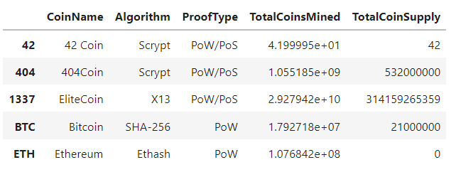
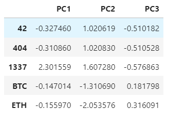
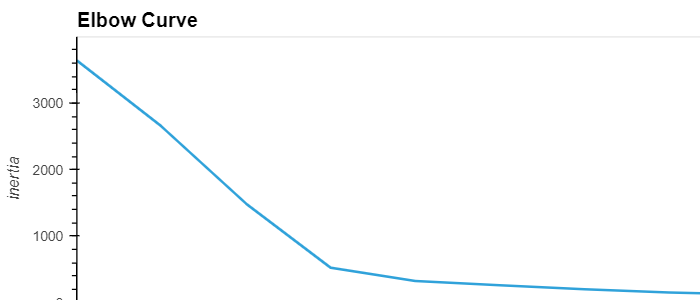
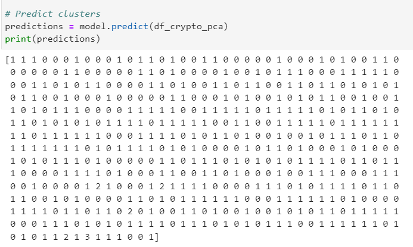
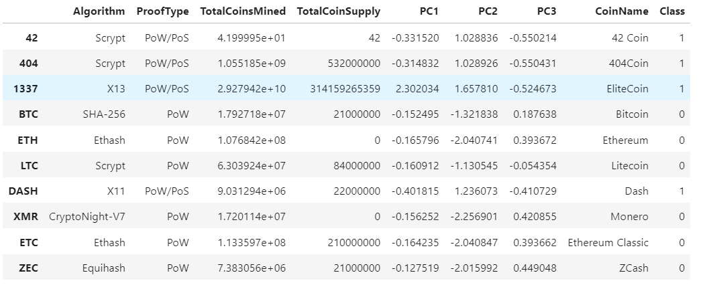
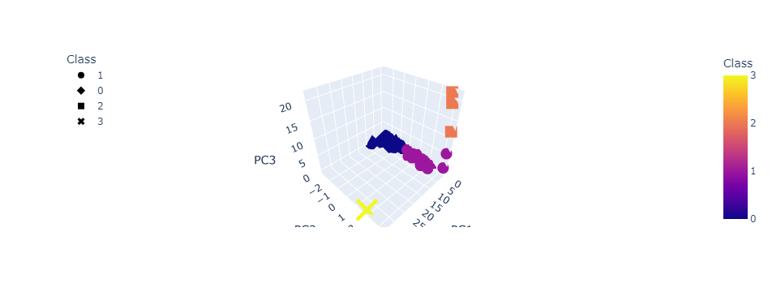
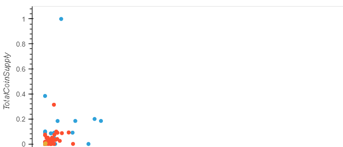

# **Cryptocurrencies**

## **Overview**

The purpose of this analysis is to creat a report that shows what cryptocurrencies are on the market and how they can be grouped by creating a classification system. 
 

**Deliverable 1:Preprocessing the Data for PCA**  - This involed selecting the data to be used. For this analysis, we are using the cryptocurrencies that that are being traded, currencies with working algorithms, and the total coins mined. The *IsTrading* column was removed.

**Deliverable 2: Reducing Data Dimensions Using PCA** - Since the dataset we are using is a large one, we use PCA to speed up machine learning algorithms and to avoid overfitting the data. Three principal components were used to reduce the data dimensions and a dataframe was created to hold the three principal components. 

**Deliverable 3: Clustering Cryptocurrencies Using K-means** - An elbow curve was created to find the best value for *k*. Then the predictions functions was used to predict the clusters. Finally, a new dataframe to hold the clusters was created. 

**Deliverable 4: Visualizing Cryptocurrencies Results

3D Scatter using the PCA data and Clusters. 

Scatter Plot using x=TotalCoinsMined and y=TotalCoinSupply

 

